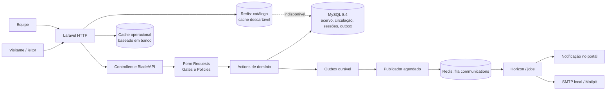
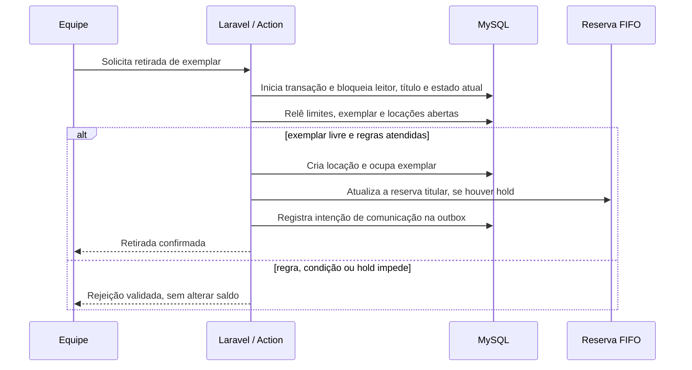
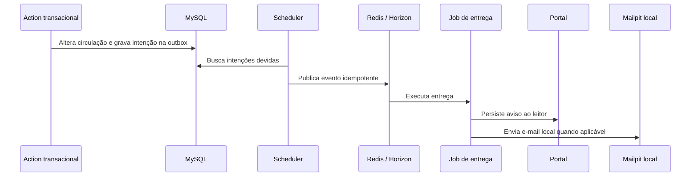

# Arquitetura da aplicação

> **Situação:** as capacidades descritas de F2 a F7 foram validadas no ambiente local isolado. A F7 comprovou imagem PHP 8.4/Apache, Compose separado, seeder fictício, jornadas de navegador, suíte MySQL, recuperação automática após falha induzida, rollback, deploy C, backup e restauração lateral. Essa conclusão não equivale a publicação em nuvem ou ambiente de produção externo.

## Objetivo e fronteiras

Esta é uma biblioteca única, com portal do leitor e gestão operacional pela equipe. O sistema é um monólito Laravel com telas Blade renderizadas no servidor e uma API auxiliar para integrações do leitor. Não há multiempresa, serviço de nuvem, RabbitMQ, aplicativo móvel nativo ou e-mail transacional externo demonstrado.

O modelo concentra as regras de negócio nas Actions, valida os dados em Form Requests e aplica autorização por middleware, Gates e Policies. Controllers coordenam a requisição e as views exibem o resultado. MySQL 8.4 mantém o estado durável; Redis é usado de forma separada para fila e cache descartável.

## Componentes e responsabilidades

| Componente | Responsabilidade | Estado e limite relevante |
| --- | --- | --- |
| Laravel 12, PHP 8.4 e Blade | Portal, gestão, fluxos de acervo, API e validação de entrada | Aplicação única; as regras não ficam em JavaScript do navegador. |
| Actions de domínio | Retirada, devolução, perda, reconciliação, reserva, renovação e comunicações | Transações e bloqueios são aplicados nos fluxos mutáveis. |
| MySQL 8.4 | Fonte de verdade para usuários, sessões, inventário, circulação, políticas, auditoria e outbox | Histórico fechado anterior ao inventário pode não ter exemplar associado. |
| Redis de fila + Horizon | Processa a fila `communications` depois da publicação da outbox | A fila não substitui a persistência da intenção no banco. |
| Redis de catálogo | Acelera somente o catálogo público com cache LRU descartável | Em indisponibilidade, o catálogo consulta o banco; uma entrada pode ficar obsoleta até a invalidação/TTL. |
| Cache operacional em banco | Sessões, limitação, revisões e métricas operacionais | Evita tornar um cache descartável a única base de controle de acesso. |
| Mailpit local | Caixa de inspeção de e-mails no ambiente isolado | Não prova entrega a um provedor SMTP externo nem ao destinatário final. |
| Compose de demonstração F7 | Sete serviços isolados: app, MySQL, Redis de fila, Redis de catálogo, Horizon, scheduler e Mailpit | Projeto `biblioteca-demo`, HTTP em `8089` e Mailpit em `8029`, ambos em loopback; deploy C, backup e restauração lateral foram aprovados. |

## Inventário e circulação

Cada título novo começa em **reconciliação**. A equipe confirma as unidades físicas, com código patrimonial único, identificação e condição, antes de habilitar novas retiradas. Depois desse corte, os saldos do título são derivados dos exemplares; a edição manual de quantidade é recusada.

Uma locação aberta referencia uma única unidade em circulação. A devolução encerra a locação e libera a unidade; perda encerra a locação com motivo e marca a unidade como extraviada. O histórico fechado não é fabricado: locações anteriores à migração podem manter `exemplar_id` nulo.

As operações concorrentes bloqueiam e releem o estado em ordem **leitor → título → locação**. Essa ordem reduz a disputa entre retirada, devolução, perda, reserva e renovação. As corridas relevantes foram exercitadas com processos MySQL separados, pois SQLite em memória não reproduz locks e snapshots MVCC do banco-alvo.

Reservas são ordenadas por criação e ID como desempate. O primeiro leitor elegível recebe um hold de 48 horas quando houver exemplar; outra pessoa não pode retirar essa unidade. Políticas de circulação são versionadas e o snapshot aplicado permanece ligado à locação, renovação ou reserva pertinente. A política inicial usa 14 dias, máximo de três locações abertas, uma renovação e bloqueio por atraso.

## Comunicação e rastreabilidade

O fluxo de comunicação separa a alteração de domínio do envio:

A outbox torna a intenção de comunicação durável antes da fila. Há reprocessamento administrativo de falhas e logs correlacionam requisição, outbox e job por `request_id`/correlation ID. Ainda existe a janela normal do SMTP: não há garantia de entrega exatamente uma vez ao servidor externo ou ao destinatário. O efeito local validado é a criação idempotente do aviso e o envio observado no Mailpit.

Logs estruturados não incluem corpo de requisição, query string, token, credenciais ou dados pessoais. As métricas de latência, erro e jobs são agregadas em buckets limitados; sob contenção uma amostra pode ser perdida. Elas orientam operação e diagnóstico, mas não são trilha de auditoria exata.

## Integrações, relatórios e acesso

O leitor usa sessão persistida no banco e as funções administrativas exigem papel ativo. A inativação e a alteração de acesso revogam sessões persistentes e tokens pessoais de API. Essa escolha permite revogação no servidor, sem confiar no navegador como fonte de verdade.

A consulta ISBN usa somente a busca da Open Library em host fixo. Ela normaliza e valida ISBN-10/13, procura uma **edição** dentro do resultado da obra, limita tempo, tamanho de resposta, ritmo e tentativas, e armazena achados por sete dias e ausências por uma hora. Se o fornecedor estiver indisponível, a tela mantém o cadastro manual; sugestão confirmada apenas preenche o formulário e não cria livro automaticamente.

Os relatórios usam consultas SQL compartilhadas pela tela e pelo CSV. Para uma data de referência, a locação é considerada aberta quando começou até ela e não foi encerrada antes do fim do dia; o vencimento histórico considera a primeira renovação posterior à referência. O CSV preserva filtros, ordenação e população, evita fórmulas em planilhas e não exporta PII de leitores. A fila de reservas retrata a posição atual e a idade atual: não declara tempo histórico de espera que o modelo não registra.

## Operação local e documentação relacionada

O Compose de desenvolvimento mantém aplicação, MySQL, Redis, worker, scheduler e Mailpit em ambiente isolado, com portas HTTP expostas somente em loopback. A F7 adiciona o projeto local separado `biblioteca-demo`, com sete serviços, imagem PHP 8.4/Apache e processo `www-data`; código não é gravável, storage é gravável e arquivos Blade compilados são isolados por release. O deploy C ficou saudável. Backup com checksum verificado e restauração lateral autenticada preservaram as contagens 5/14/30/5/3 e nenhuma locação aberta inválida, sem alterar a origem. Não é uma publicação externa.

- [Guia de desenvolvimento](desenvolvimento.md): inicialização, papéis, operações e limites locais.
- [Decisões de arquitetura](decisoes.md): escolhas e consequências assumidas.
- [Execução F2–F7](execucao-f2-f7.md): evidências de validação por fase.
- [Demonstração](demonstracao.md) e [operação local](deploy-local.md): cenário fictício e runbook F7.
- [API](api.md), [ISBN](integracao-isbn.md), [Relatórios](relatorios.md) e [Observabilidade](observabilidade.md): contratos específicos.
