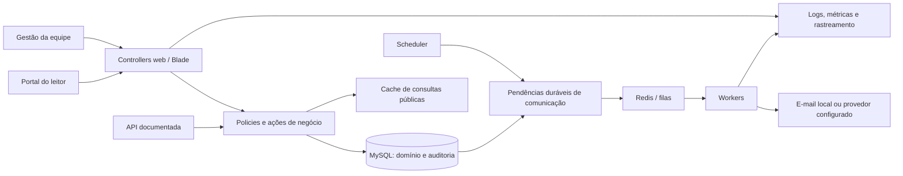

# Plano de evolução da Biblioteca

Data: 25/09/2026. Status: F0–F7 implementadas e validadas para demonstração local. A sequência e as evidências estão em [execução F2–F7](execucao-f2-f7.md). O CI remoto está preparado, mas não foi executado por ainda não haver publicação. O diagnóstico abaixo preserva a linha de base do planejamento; a implementação e as evidências atuais estão em [desenvolvimento](desenvolvimento.md).

## 1. Objetivo e escopo confirmado

Evoluir a aplicação para uma **biblioteca única, com gestão da equipe e portal do leitor**, demonstrando um ciclo completo de engenharia: regra de negócio, segurança, consistência, testes, execução reproduzível, processamento assíncrono, API, operação e recuperação.

Essa direção foi escolhida pelo usuário. A arquitetura, os papéis, a modelagem e a sequência abaixo são recomendações para concretizá-la. Atualização de execução: o usuário aprovou 14 dias corridos, limite de 3 empréstimos, uma renovação de 14 dias, fila por ordem de chegada e 48 horas de retirada, bloqueio por atraso, fuso de São Paulo e encerramento por perda com motivo. O destino de F7 é a demonstração local em Docker.

O resultado pretendido é permitir que um leitor encontre um título, acompanhe seus empréstimos, reserve e renove quando elegível; a equipe controla cada exemplar, registra circulação e acompanha pendências. Falhas, acessos indevidos e disputas pelo mesmo recurso devem ter comportamento testado e explicável.

## 2. Ponto de partida do diagnóstico inicial

> Esta tabela é um retrato do checkout **antes** da execução das fases F0–F7. Ela preserva o raciocínio do plano, mas não descreve o estado atual de runtime, PHP, autorização, inventário, Redis ou Compose. Consulte [execução F2–F7](execucao-f2-f7.md) e [desenvolvimento](desenvolvimento.md) para as evidências atuais.

| Superfície | Evidência no diagnóstico inicial | Consequência para o plano |
| --- | --- | --- |
| Stack | `composer.json`: Laravel 12, PHP declarado como `^8.2`, PHPUnit, Pint e Sail entre as dependências de desenvolvimento. | Aproveitar Laravel/Blade e verificar runtime e compatibilidade antes de escolher versões de imagens e ferramentas. Sail instalado não significa ambiente Docker configurado. |
| Produto | `routes/web.php`, controllers e views: autores, categorias, livros, empréstimos, devoluções e catálogo inicial público. | Preservar fluxos e identidade visual existentes, expandindo as jornadas. |
| Identidade | `AuthController` e `routes/web.php`: cadastro público, sessão e gestão protegida somente por autenticação. | Qualquer conta registrada acessa a gestão. Separar autorização de autenticação antes de exposição pública. |
| Acervo | `Livro` e migration de livros: quantidades agregadas; ISBN opcional; um autor e uma categoria por registro. | Não há identificação de unidade física. Introduzir exemplares antes de manutenção, perdas e reservas com separação para retirada. |
| Circulação | `LocacaoController`: transações, bloqueio de livro, prevenção de empréstimo aberto duplicado e devolução idempotente. | Preservar essas garantias; testar concorrência real e estendê-las ao novo modelo. |
| Histórico | Controllers bloqueiam algumas exclusões; migrations de livros e locações declaram `cascadeOnDelete`. | Proteção na interface não garante retenção diante de outros caminhos de escrita. Planejar constraints e ciclo de inativação. Não houve inspeção do schema efetivamente instalado. |
| Regras | Prazo escolhido no formulário; atraso calculado pela data, embora o enum também aceite `atrasada`. | Definir política de circulação e separar estado persistido de situação calculada. |
| Testes | 18 métodos de teste localizados; `phpunit.xml` usa SQLite em memória e fila síncrona. | Há uma base de regressão. Dois testes são exemplos; a contagem não mede profundidade. Execução atual e concorrência em MySQL não foram validadas nesta análise. |
| Integrações e operação | **Registro histórico do diagnóstico:** não foram encontrados API/OpenAPI, jobs de negócio, uso aplicado de Redis, Compose, pipelines, infraestrutura como código ou telemetria dedicada. | Esse ponto foi superado nas F4–F6: as capacidades e seus limites estão em `api.md`, `observabilidade.md` e `execucao-f2-f7.md`; configurações padrão continuam não contando como entrega. |
| Interface | Blade com CSS/JS e bibliotecas locais; README explica que o front entregue não depende de Vite em runtime. | Preservar os assets atuais. Validar o caminho realmente usado pelas telas, além de eventual build. |

Fontes locais principais: [README](../README.md), [análise anterior](analise-e-melhorias.md), [rotas](../routes/web.php), [circulação](../app/Http/Controllers/LocacaoController.php), [livros](../app/Http/Controllers/LivroController.php), [testes funcionais](../tests/Feature/BibliotecaManagementTest.php) e [configuração dos testes](../phpunit.xml).

## 3. Arquitetura recomendada

Manter um **monólito Laravel modular**, com Blade e o visual atual. Extrair ações de negócio conforme os fluxos evoluírem, para que web, API e jobs compartilhem as mesmas regras. Não criar uma arquitetura genérica de repositórios ou microserviços sem necessidade identificada.

Módulos lógicos: Identidade, Catálogo/Acervo, Circulação, Reservas, Comunicação e Relatórios. A separação pode começar por Actions, Policies, Requests e consultas específicas dentro do padrão Laravel, sem uma reorganização ampla do projeto.

O desenho é alvo proposto, não infraestrutura já existente.

| Escolha recomendada | Motivo e limite |
| --- | --- |
| Docker Compose; avaliar Sail já instalado para desenvolvimento | Facilitar reprodução em uma máquina limpa. No Windows, Sail usa WSL2; confirmar suporte local antes da implementação. A imagem de publicação será própria, sem ferramentas de desenvolvimento. |
| MySQL como banco de referência para integração, concorrência e demonstração | Escolher um banco com bloqueios de linha e validá-lo de ponta a ponta. Não pressupõe que o ambiente atual já use MySQL. Versão deve ser fixada e mantida em desenvolvimento, CI e deploy. SQLite pode continuar em testes rápidos adequados. |
| Redis para filas e cache; Horizon para operação das filas | Reaproveitar integração do Laravel e demonstrar jobs reais. Cache é descartável; fila exige persistência e política de memória apropriadas. Separar instâncias/conexões operacionais no deploy quando necessário; apenas separar prefixos não impede eviction. |
| Mailpit no desenvolvimento e na demonstração local | Validar o efeito final de e-mails usando destinatários fictícios, sem envio externo involuntário. Provedor de produção fica para a etapa de publicação. |
| API com Sanctum, caso tokens de integração sejam necessários, e OpenAPI | Criar um consumidor concreto e contratos testáveis. O portal Blade continua usando sessão; não precisa consumir a própria API para justificar sua existência. |
| CI com PHPUnit, Pint e análise estática compatível com Laravel | Automatizar controles progressivos. Validar dependências e escolher nível inicial útil, sem baseline que silencie indiscriminadamente erros. |
| Observabilidade progressiva | Começar com logs estruturados e correlação; adicionar métricas e traces aos fluxos assíncronos. Painéis operacionais devem ter acesso restrito. |

**RabbitMQ:** extensão de portfólio condicionada a um objetivo explícito de demonstrar broker e integração entre produtores/consumidores. Nesse caso, escolher um fluxo, validar adaptador mantido, confirmações, redelivery, mensagens inválidas, fila de falhas e reprocessamento. Redis Queue não comprova experiência em RabbitMQ, e Horizon opera filas Redis. Evitar dois brokers no primeiro recorte funcional.

## 4. Modelo de produto e regras que precisam de decisão

### Acesso e jornadas propostas

| Perfil proposto | Pode fazer | Limites |
| --- | --- | --- |
| Visitante | Buscar catálogo ativo e consultar disponibilidade pública. | Não acessa leitores, empréstimos identificáveis, estoque interno detalhado ou indicadores de operação. |
| Leitor | Consultar os próprios empréstimos e histórico, reservar, cancelar sua reserva e solicitar renovação elegível. | Não altera acervo, papéis ou empréstimos de terceiros; não confirma devolução física. |
| Bibliotecário | Gerir acervo/exemplares, cadastrar e atender leitores, registrar retirada/devolução e tratar ocorrências autorizadas. | Não concede papel administrativo; exceções operacionais devem ter permissão e motivo próprios. |
| Administrador | Gerir equipe, papéis e parâmetros; consultar auditoria e ferramentas operacionais autorizadas. | Ações sensíveis continuam auditadas e sujeitas às regras de integridade. |

Proposta: cadastro público cria somente leitor. O procedimento inicial deve provisionar explicitamente um administrador e mapear as contas existentes, preservando histórico e acesso legítimo. Não promover automaticamente todos os usuários antigos. Perfil operacional de leitor deve ser separado do papel de gestão quando uma pessoa da equipe também puder emprestar livros.

### Evolução de entidades

- **Livro:** título/edição do catálogo, preservando o modelo atual e seus identificadores inicialmente. ISBN identifica a edição, não a unidade física. Coautoria, capa e metadados adicionais são complementos posteriores.
- **Exemplar:** unidade física com código patrimonial único, vínculo com livro e condição de acervo, como em circulação, em manutenção, extraviado ou baixado. Disponibilidade considera essa condição, título ativo, empréstimo aberto e eventual separação para reserva; não deve existir como um segundo saldo editável independente.
- **Locacao:** manter nome interno e rotas inicialmente; novos empréstimos vinculam exemplar, leitor, operador e política aplicada. Atraso é derivado do prazo de uma operação aberta. Encerramentos por perda, quando aprovados, não podem ser registrados como devolução física.
- **Reserva:** solicitada por título/edição; quando atendida, pode separar um exemplar para retirada por prazo definido. Estados e transições devem ser explícitos e auditados.
- **Renovação:** evento que conserva prazo anterior, prazo novo, responsável, momento e regra aplicada.
- **Auditoria:** eventos das operações relevantes, gravados junto da transação de domínio; acesso restrito e conteúdo mínimo. Append-only pela aplicação não equivale a inviolabilidade contra administradores do banco.
- **Comunicação:** pendência persistida com chave de negócio, canal, versão do evento, tentativas e resultado. Sustenta conciliação e reprocessamento quando worker ou provedor falhar.

### Decisões pendentes por etapa

| Decisão | Recomendação inicial para discutir | Necessária antes de |
| --- | --- | --- |
| Inscrição e elegibilidade | Aprovado: cadastro automático como leitor, sem acesso à gestão e sem aprovação adicional. Verificação de e-mail não é condição desta entrega. | F1 definido |
| Pessoas sem acesso ao portal | Aprovado: usar conta com e-mail nesta entrega. A equipe pode inativá-la; não enviar convites automaticamente. | F1 definido |
| Prazo e limite de empréstimos | Parâmetros explícitos; definir unidade de tempo, fuso, calendário e possibilidade de exceção. Não fixar números nesta análise. | F3 |
| Renovação | Proposta: negar quando houver reserva elegível aguardando; definir limites e tratamento de atraso. | F3 |
| Reserva | Proposta: fila por ordem de solicitação com desempate estável; definir elegibilidade, prazo de retirada, prioridades e se aceita título já disponível. | F3 |
| Bloqueio por atraso | Definir ações bloqueadas, exceções e responsável por liberar. Manter acesso ao histórico pessoal. | F3 |
| Perda, dano e baixa | Definir quem registra, se o empréstimo é encerrado e quando o exemplar volta a circular. | F2/F3 |
| Notificações | Começar com e-mail e aviso no portal; definir antecedência, repetição, preferências e situações que invalidam o aviso. | F4 |
| Dados e histórico | Definir acesso, retenção, inativação e eventual anonimização; minimizar campos pessoais. | F1 e publicação |
| Demonstração e orçamento | Aprovado: demonstração Docker somente local, com dados fictícios, sem provedor, domínio, TLS público ou custo de cloud. | F7 |

Essas decisões não impedem organizar o backlog ou montar a base técnica. Bloqueiam somente a implementação das regras correspondentes. Multas financeiras e cobranças ficam fora do primeiro escopo.

## 5. Sequência de execução

Esforço relativo: **M** = mudança delimitada com testes e configuração; **G** = mudança transversal ou de modelo, a dividir em entregas menores. Não são estimativas de prazo.

| Fase | Resultado | Dependência | Esforço | Evidência principal |
| --- | --- | --- | --- | --- |
| F0 | Ambiente reproduzível e controles de qualidade | Nenhuma | M | Checkout novo executa aplicação e testes; CI bloqueia regressões. |
| F1 | Papéis, leitores e portal inicial seguro | F0 e decisões de identidade | G | Matriz de permissões aprovada e testada em todas as superfícies. |
| F2 | Inventário por exemplar e circulação consistente | F1 e reconciliação do legado | G | Migração ensaiada; disputas concorrentes preservam invariantes. |
| F3 | Reservas, renovação e políticas de circulação | F2 e políticas decididas | G | Jornada completa entre leitor e equipe, incluindo conflitos. |
| F4 | Notificações e automações confiáveis | F3 | M/G | Falhas de worker/provedor são observadas e recuperadas. |
| F5 | API e integração bibliográfica delimitadas | F2; F3 para reservas; F4 para tarefas assíncronas | M/G | Contrato consumível e falha externa tratada. |
| F6 | Relatórios, desempenho e telemetria consolidada | F3/F4; independe de concluir F5 | M/G | Números reconciliados e desempenho medido. |
| F7 | Demonstração local, recuperação e apresentação | F1–F6 aprovadas no recorte escolhido | G | Compose isolado, smoke autenticado, restauração e roteiro demonstrável. |

F5 e F6 podem avançar em paralelo após estabilizar contratos compartilhados. Segurança, testes, auditoria e logs são requisitos de cada fase; não ficam adiados para F6/F7.

### F0 — Reprodução e qualidade

- **F0.1:** inventariar runtime, dependências, scripts e assets efetivos; verificar suporte das versões antes da publicação. Não executar `composer setup` automaticamente: o script atual inclui migrations.
- **F0.2:** configurar Compose/Sail para desenvolvimento com aplicação, banco dedicado, Redis e Mailpit; acrescentar worker e scheduler quando os fluxos da F4 existirem. Fixar versões, health checks e instruções Windows/WSL2. A conectividade do Redis será validada aqui; seu uso em uma funcionalidade só será demonstrado nas fases seguintes.
- **F0.3:** criar CI para sintaxe, Pint, análise estática, PHPUnit e integridade dos assets locais. Separar testes rápidos de integração em MySQL; dados sintéticos e bancos exclusivos de teste.
- **F0.4:** criar factories/fixtures representativas e registrar a linha de base. Tornar logs e falhas compreensíveis desde o início.

**Aceite:** executar do zero com documentação curta; suíte atual realmente executada; novo job de CI falha quando uma regra protegida é quebrada; setup e testes não usam o banco operacional. Incluir reprodução por terceiro ou ambiente limpo. Nenhuma publicação aberta antes de F1.

### F1 — Identidade, autorização e portal inicial

- **F1.1:** definir matriz de acesso, provisionamento inicial e mapeamento de usuários; adicionar policies e autorizações no servidor para leitura e escrita.
- **F1.2:** separar home pública, portal pessoal e gestão. Corrigir também consultas, detalhes e indicadores que hoje usam apenas a presença de sessão para expor a operação completa.
- **F1.3:** adicionar limitação de tentativas de login e fluxos de recuperação/verificação de e-mail conforme política; validar mensagens e não expor informações de conta desnecessariamente.
- **F1.4:** implementar histórico e empréstimos próprios; registrar alterações de papel e ações sensíveis. Introduzir Actions apenas onde houver regra compartilhada.

**Aceite:** visitante, leitor, bibliotecário e administrador testados; leitor A não acessa dados de B trocando identificadores; não há promoção por payload; cadastro não concede gestão; funcionário não altera papéis; revogação de acesso produz efeito nas rotas protegidas. Testar erro, vazio, loading quando assíncrono, sucesso, teclado e mobile.

### F2 — Exemplares, integridade e transição do legado

- **F2.1:** especificar código patrimonial, condição do acervo e disponibilidade derivada. Criar novas estruturas por migrations aditivas; preservar identificadores públicos existentes.
- **F2.2:** antes de qualquer alteração em banco existente, executar inventário autorizado, backup proporcional e ensaio em cópia isolada. Conferir, por título, total, disponível e número de empréstimos abertos. Divergência exige resolução explícita, não ajuste silencioso.
- **F2.3:** criar exemplares de migração com origem identificada. Empréstimos antigos encerrados mantêm histórico por título e exemplar desconhecido. Para empréstimos abertos, atribuição de unidade exige conciliação física ou identificação provisória claramente marcada; não inventar número patrimonial histórico.
- **Gate de corte por título:** ativar a nova circulação somente depois de conciliar o inventário e vincular todos os empréstimos abertos daquele título a exemplares reais identificados. Enquanto houver pendência, manter apenas devolução/reconciliação pelo fluxo legado e bloquear novos empréstimos, reservas com alocação e disponibilidade para retirada nesse título. Um identificador técnico provisório não satisfaz a conciliação física. O modo de operação por título deve ser explícito, impedindo que os dois modelos gravem simultaneamente sobre o mesmo acervo.
- **F2.4:** mover retirada/devolução para ações transacionais; proteger unicidade de ocupação e duplicidade conforme o banco escolhido. Revalidar autorização, elegibilidade e disponibilidade dentro da operação. Adotar ordem consistente de locks e testar limites globais do leitor quando existirem.
- **F2.5:** ensaiar corte controlado entre saldo agregado e exemplares. Conservar contadores antigos somente durante reconciliação; evitar dois caminhos independentes de atualização. Definir rollback antes do corte e estratégia de compatibilidade após novas escritas.
- **F2.6:** revisar cascatas das entidades com histórico; substituir remoção operacional por inativação/baixa quando houver vínculo histórico. Registrar manutenção, perda e retorno ao acervo com motivo e responsável.

**Aceite:** duas solicitações simultâneas para a última unidade geram no máximo um empréstimo; repetição de devolução não libera duas unidades; item em manutenção/perdido não é elegível; títulos e saldos reconciliam; histórico encerrado não recebe exemplar fictício; rollback é ensaiado sem apagar as escritas posteriores. Testes concorrentes usam conexões/processos independentes em MySQL, não apenas chamadas sequenciais em SQLite.

### F3 — Reservas, renovação e circulação completa

- **F3.1:** parametrizar política aprovada e preservar a regra aplicada em cada operação para que mudanças futuras não reescrevam o passado.
- **F3.2:** implementar reserva por título, consulta da fila pela equipe, cancelamento pelo titular e separação de exemplar para retirada.
- **F3.3:** integrar devolução e atendimento da próxima reserva elegível. Proteger concorrência entre empréstimo direto, alocação, cancelamento e expiração.
- **F3.4:** implementar renovação com histórico de prazo e bloqueios aprovados; tratar duas renovações simultâneas sem ultrapassar limites.
- **F3.5:** exibir ao leitor prazos, posição/estado de reserva conforme política e motivos de bloqueio; à equipe, pendências acionáveis.

**Aceite:** reserva duplicada e acesso a reserva alheia são negados; prioridade aprovada é preservada; um exemplar separado não é emprestado indevidamente a outra pessoa; expiração libera ou realoca conforme regra; prazo vencido é revalidado na transação mesmo se o scheduler atrasar; renovação respeita reservas e limites. Se houver limite global por leitor, duas retiradas simultâneas de títulos diferentes também devem respeitá-lo. Testar fronteiras de data/fuso e condições concorrentes.

### F4 — Filas, lembretes e tarefas agendadas

- **F4.1:** adicionar jobs reais para lembrete de vencimento/atraso e aviso de reserva disponível; notificações internas e Mailpit como primeiro canal verificável.
- **F4.2:** implementar uma outbox de comunicação: persistir a intenção na mesma transação do evento relevante, com chave de negócio/versão. Um relay publica as pendências e a conciliação identifica intenções ainda não concluídas, tolerando republicação com tratamento idempotente. Essa pendência durável é a própria outbox, não um mecanismo adicional. `afterCommit` evita consumir antes do commit, mas isoladamente não resolve a falha entre commit e publicação no broker.
- **F4.3:** configurar tentativas limitadas, backoff, timeout, falhas persistidas e reprocessamento. Evitar sobreposição de agendamentos; revalidar o estado atual antes do envio para não lembrar um empréstimo já devolvido ou uma reserva cancelada.
- **F4.4:** adicionar Horizon e acesso restrito; observar tempo de espera, execução e falhas. Separar tarefas longas de notificações quando houver competição relevante.

**Aceite:** parar e reiniciar worker não elimina a intenção de notificar; executar o mesmo agendamento não cria novas intenções duplicadas; falha de provedor pode ser repetida com limite e visibilidade; mensagem esperada aparece no destino local. SMTP pode aceitar uma mensagem antes de a aplicação registrar o sucesso: documentar essa janela de duplicação e usar idempotência do provedor quando disponível, sem prometer entrega exatamente uma vez.

### F5 — API e integração com finalidade definida

- **F5.1:** publicar contrato OpenAPI para catálogo e área pessoal; adicionar reservas/renovações depois de F3. API e web chamam as mesmas ações e policies.
- **F5.2:** implementar autenticação apropriada, escopos quando aplicáveis, paginação, filtros, erros consistentes, rate limiting e idempotência das mutações relevantes. Criar um cliente de demonstração ou coleção executável.
- **F5.3:** adicionar consulta bibliográfica por ISBN para ajudar o cadastro, escolhendo previamente provedor, contrato, limites e condições de uso. Exibir proposta para confirmação; não sobrescrever silenciosamente o catálogo.
- **F5.4, opcional:** importação CSV com prévia, validação por linha, limites e relatório de resultado; deduplicação, execução assíncrona e possibilidade de retomar lotes quando o volume justificar.

**Aceite:** integração reproduzida pela documentação; testes de contrato e autorização passam; timeout/indisponibilidade do provedor não impedem cadastro manual; resposta externa inválida não grava dados; payload de terceiros não se transforma em HTML executável. Importação, se incluída, não duplica títulos/exemplares por repetição do lote.

### F6 — Relatórios, desempenho e observabilidade

- **F6.1:** definir indicadores úteis: empréstimos por período, abertos/atrasados em uma data de referência, demanda por título, fila e tempo de espera de reservas, exemplares indisponíveis por motivo. Documentar denominadores e população de cada indicador.
- **F6.2:** criar filtros e exportação CSV com o mesmo escopo e critérios da tela. Arquivos com dados pessoais têm autorização no download, expiração e proteção contra fórmulas em planilhas.
- **F6.3:** paginar relações hoje carregadas integralmente; medir consultas e índices com dataset sintético e plano de execução. Aplicar Redis a leituras adequadas, com invalidação; autorização e decisão final de empréstimo continuam consultando a fonte transacional.
- **F6.4:** correlacionar request, operação e job em logs; adicionar métricas de latência, erros e filas; rastrear ao menos um fluxo completo. Definir alertas com ação e runbook.
- **F6.5:** criar teste de carga reproduzível e registrar cenário, hardware, volume, p95, erros e recursos. Fixar meta após baseline; não inventar capacidade ou escalabilidade a partir de contagem de registros.

**Aceite:** indicadores e exportação reconciliam com fixtures; acesso por perfil continua correto; cache invalidado reflete mudança; benchmark é reproduzível e compara antes/depois; falha induzida é localizada por logs/traces e produz alerta útil. Dados pessoais e segredos não aparecem na telemetria.

### F7 — Demonstração local e apresentação verificável

- **F7.1:** manter Compose local separado, imagem PHP/Apache mínima, segredos fora do repositório, banco protegido e worker/scheduler supervisionados. Separar desenvolvimento, dados fictícios e volumes da demonstração.
- **F7.2:** versionar o artefato local, aplicar migrations uma vez, reiniciar workers com segurança, executar health check e smoke autenticado. Não rodar migration em cada processo concorrente.
- **F7.3:** ensaiar backup e restauração em banco lateral; manter runbook de incidente e rollback que distingue código, schema, dados, jobs pendentes e efeitos externos. Não tratar rollback como sinônimo de apagar banco.
- **F7.4:** registrar arquitetura, decisões, contratos, limitações, evidências e roteiro curto. Publicação em nuvem, TLS e infraestrutura de provedor ficam fora deste recorte.

**Aceite:** clone/ambiente local reproduzíveis; Compose isolado concluído; visitante, leitor e equipe verificados no browser; fila e scheduler exercitados até o efeito final; recuperação da última versão válida, restauração e rollback documentados e ensaiados; dados fictícios; nenhuma interface administrativa ou de telemetria exposta sem autorização. Não há aceite de domínio público, cloud ou SMTP externo.

## 6. Recortes de entrega e prioridade

1. **Primeira entrega — F0 + F1:** base reproduzível, pipeline, papéis e portal pessoal de leitura. Remove a lacuna de autorização e permite evoluir com regressão controlada.
2. **Biblioteca funcional completa — F2 + F3:** exemplares, circulação, reservas, renovação, inventário e auditoria. É o núcleo do produto.
3. **Caso técnico de portfólio — F4 + F5 + F6:** processamento assíncrono com falhas demonstráveis, API, integração delimitada, relatórios e desempenho/telemetria.
4. **Demonstração operável — F7:** execução local, recuperação e material que permita verificar as decisões e o funcionamento.

Dividir cada fase em mudanças pequenas e revisáveis. Mudança de schema, backfill, alteração de regra e troca de infraestrutura não devem entrar em um único pacote sem pontos de validação.

Ficam para uma evolução posterior: múltiplas bibliotecas/tenants, multas/pagamentos, app nativo, IA de recomendação, Elasticsearch sem necessidade de busca medida, Kubernetes, Kafka e decomposição em microserviços. RabbitMQ pode entrar como estudo delimitado conforme a decisão da seção 3.

## 7. Critério de conclusão do plano implementado

- Outra pessoa prepara o ambiente com instruções reproduzíveis e dados fictícios.
- Visitante, leitor e equipe têm jornadas e permissões distintas, verificadas no servidor e na UI.
- Cada novo empréstimo tem exemplar identificável; disponibilidade e histórico permanecem coerentes em concorrência.
- Reserva, renovação e exceções seguem políticas explícitas, com rastreabilidade.
- Falhas de integração e de jobs podem ser entendidas e reprocessadas com limites conhecidos.
- API, testes, pipeline e documentação refletem o comportamento efetivo.
- Desempenho tem medições reproduzíveis; publicação e recuperação têm evidências.
- O material de portfólio separa capacidades demonstradas, simulações e limites. Não atribui escala, uso real ou experiência de produção que não foram comprovados.

## 8. Validação da etapa de planejamento (histórico)

Foram inspecionados código, rotas, models, migrations, testes, dependências e documentação. Houve revisão independente de produto/dados e arquitetura. As conclusões sobre estrutura são estáticas: não foram consultados dados operacionais, executadas migrations, rodados testes, enviados e-mails, iniciados serviços ou publicados artefatos externos.

A etapa original foi documental. Posteriormente, o usuário autorizou a execução e definiu o cadastro automático como leitor e o uso de conta com e-mail. F0–F7 foram implementadas e validadas para demonstração local. As evidências, os limites e as instruções estão no guia de desenvolvimento e no registro de execução F2–F7. O usuário autorizou a execução sequencial das demais fases e definiu suas regras no registro de execução; a tabela de decisões acima preserva as recomendações do planejamento original.

## 9. Referências técnicas consultadas

- [Laravel 12 — filas e transações](https://laravel.com/docs/12.x/queues): suporte a Redis, processamento após commit, tentativas e falhas.
- [Laravel 12 — Horizon](https://laravel.com/docs/12.x/horizon): gerenciamento de filas Redis; não gerencia RabbitMQ.
- [Laravel 12 — Sail](https://laravel.com/docs/12.x/sail): ambiente Docker de desenvolvimento e uso no Windows via WSL2.
- [RabbitMQ — confiabilidade](https://www.rabbitmq.com/docs/reliability): confirmações, redelivery e processamento idempotente; referência da pesquisa anterior.
- [AWS — transactional outbox](https://docs.aws.amazon.com/prescriptive-guidance/latest/cloud-design-patterns/transactional-outbox.html): consistência entre gravação no banco e publicação de eventos; referência da pesquisa anterior.

Referências de framework seguem a versão encontrada no projeto; compatibilidade, manutenção e suporte devem ser revalidados ao iniciar a execução.
